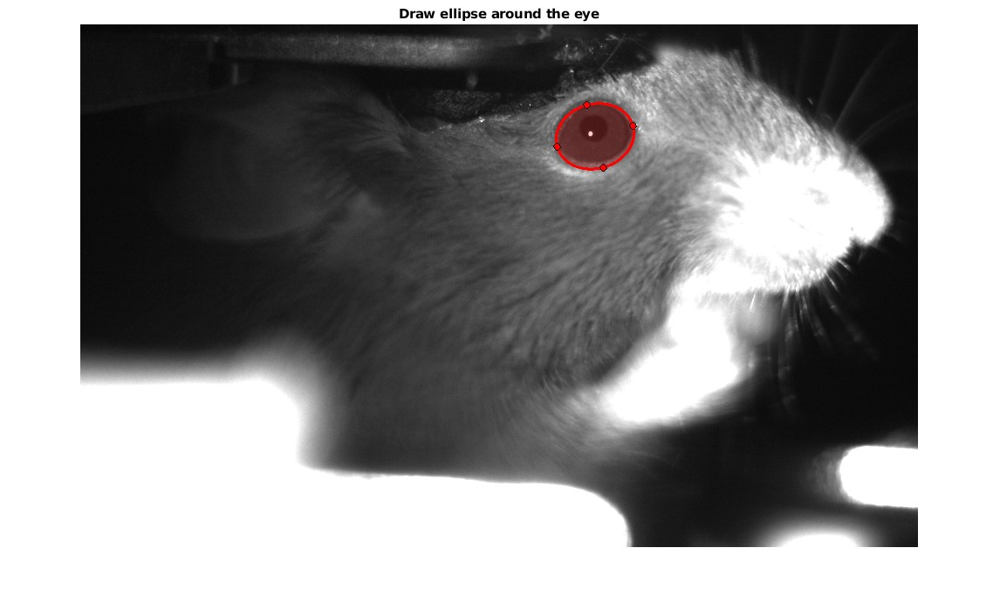
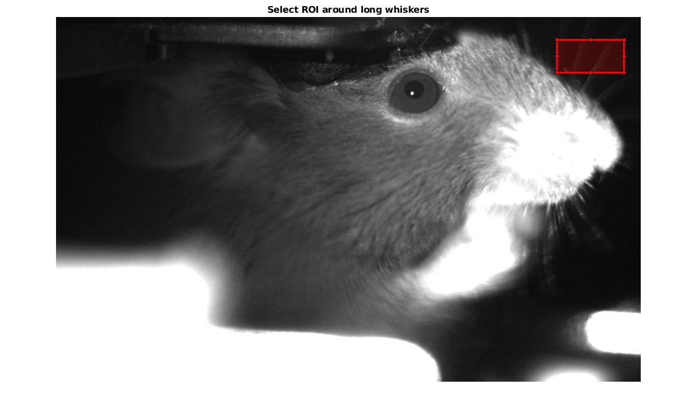
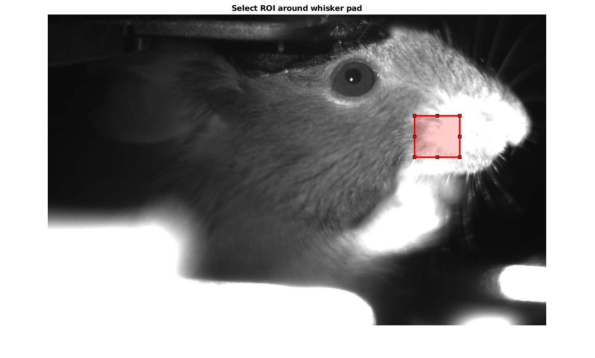

# Behavior tracking for various _in vivo_ mouse experiments

This repository contains an script-based program for tracking pupil dilation and whisker motion detection.

## Navigation 

- complete_behavior - contains both pupillometry and whisker calculations
- pupil - tracks pupil dilation
- whisking - tracks whisking detection

All modules are independent of reach other and have separate main scripts denoted with DB_

## Workflow for people working on BU's SCC

1. Navigate to the folder containing the required scripts: ex. /project/dbalog/behavior-tracking/complete_behavior/
2. Copy all required scripts from the script folder to your own directory: DB_complete_analysis.m, motion_energy.m, movie.m, natsort.m, natsortfiles.m, pupil1P.m, pupil2P.m, rescale.m, smooth1d.m, thresholding.m, trigger_detection.m, whisking.m
3. Open DB_complete_analysis.m. That is the only script that needs to be run.
4. Update mouse, date, and run data.
5. Update root and save directories.
6. Run the DB_complete_analysis.m script. For best performance, run the code section by section.
7. When the first window pops up, navigate to the directory that contains the TIFF files. Click open.
8. Answer the question in the command window about the type of data you are using (1P or 2P).
9. Pupil signal:
- A figure will show up with a mouse face. Draw an ellipse around the eye. It is recommended to start from one corner of the eye and drag the ellipse to the other corner. After releasing the dragged line, the ellipse can be adjusted. Click enter to save. Examples are given below.

- Filter pupil signal if needed. The filter has to be adjusted before running the script.
- Choose the threshold for binning the pupil signal (small vs large pupil diameter).
- Trigger detection. Depending on the microscope setup this part might not be needed. Draw a rectangle in the area where LED shines on the brain (it does not need to be big, just try to grab a homogenously bright area). Click enter to save.
10. Whisker signal:
- A figure will show up with a mouse face. Draw the first rectangle around the long whiskers. Try not to catch the face, just the whiskers on a homogenous background. Draw the second ROI around the whisker pad. See examples below. Click enter to confirm.

 

- Select in the command window if you wish to make a motion energy movie or not.
- Calculate the whisker signal. 
- Rescale and smooth signal. You can adjust the second parameter of the smooth1d function if needed for less/more smooth output.
- Plot results and choose between the two methods (long whiskers or whisker pad).
- Choose the threshold for binning the whisker signal (low vs high whisking).
- Implement trigger function if needed.
11. Movie for plotting the behavioral data. Answer questions in the command window.
12. Save .mat file. The pupil dilation values are saved as your_filename.pupil_raw, your_filename.pupil_smooth and your_filename.pupil_bins for the raw, smoothed and binned signals, respectively. The raw whisking signal is in your_filename.whisker_raw, the smoothed signal is in your_filename.whisker_smooth and the binned values are in your_filename.whisker_bins.